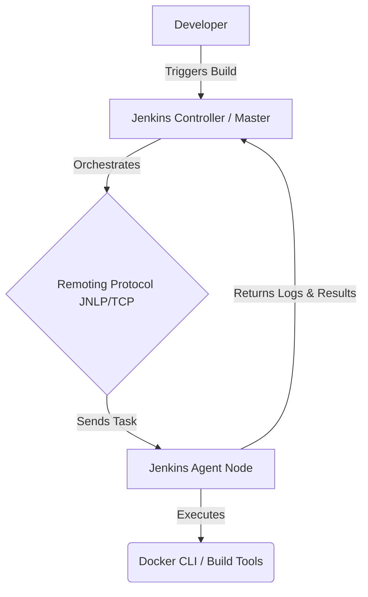

# Project Architecture: Jenkins Remoting

## High-Level Architecture
This setup demonstrates a Master-Agent distributed architecture using Jenkins.

## Component Details

### 1. Jenkins Controller (Master Node)
**Role:** The brain of the CI/CD operation.
- Runs the Web UI where users configure jobs.
- Manages credentials, plugins, and the queue of builds.
- **Node Isolation:** In a secure setup, the controller is explicitly configured *not* to run any builds itself. It only orchestrates. This prevents resource exhaustion on the master and mitigates security risks (e.g., untrusted code running with master privileges).

### 2. Jenkins Agent (Remote Node)
**Role:** The workhorse that executes the pipelines.
- An independent machine or container that connects to the Master.
- Contains the actual tools needed for building the software (e.g., Docker CLI, Java, Node.js).
- In this architecture, it connects via the `inbound-agent` method (formerly JNLP), meaning the agent initiates a connection to the master using a secret token. This is very firewall-friendly.

### 3. Remoting Channel
**Role:** Communication bridge.
- Jenkins establishes a bidirectional TCP connection between the Controller and the Agent.
- Through this channel, the Controller sends the workspace files, the commands to execute, and the environment variables.
- The Agent streams the console output logs back through this channel in real-time.

## Distributed Workload Advantages
By implementing this architecture:
1. **Scalability:** You can add as many agents as needed to handle concurrent builds.
2. **Platform Specificity:** You can have a Windows agent for compiling .NET code, a macOS agent for compiling iOS apps, and a Linux agent for Docker builds, all managed by one central Jenkins Controller.
3. **Security:** Build scripts often require privileged access (like the Docker socket). Keeping this away from the Master ensures the Master cannot be compromised by a malicious build script.
