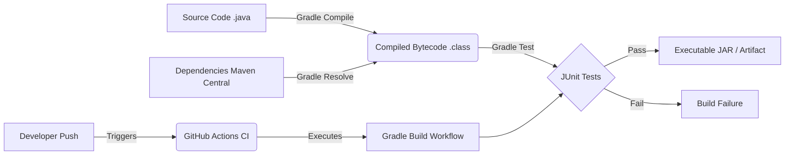

# Project Architecture: Java Application using Gradle

## High-Level Architecture
This project focuses on the build lifecycle and Continuous Integration of a Java application.

## Component Details

### 1. The Build Tool (Gradle)
**Role:** Automates the creation of the executable software from source code.
- **Dependency Management:** It resolves `com.google.guava` and `junit-jupiter` dynamically from Maven Central during the build phase. This means the repository doesn't need to store binary files, keeping it lightweight.
- **Task Execution:** Gradle operates on a Directed Acyclic Graph (DAG) of tasks. When you run `gradle build`, it automatically knows it must first run `compileJava`, then `processResources`, then `classes`, then `compileTestJava`, then `test`, and finally `assemble`.

### 2. The Application Code
**Role:** The business logic.
- Structured following standard Maven/Gradle conventions:
  - `src/main/java`: Production source code.
  - `src/test/java`: Test source code.

### 3. Continuous Integration (GitHub Actions)
**Role:** The automated gatekeeper.
- Defined in `.github/workflows/ci.yml`.
- It listens for `push` or `pull_request` events on the `main` branch.
- When an event occurs, it provisions a clean Ubuntu container, installs the correct version of Java (JDK 17), and runs the Gradle build.
- **Why this matters:** It guarantees that the code compiling on a developer's machine will also compile in a clean, isolated environment, and that all tests pass before the code is considered "good".
