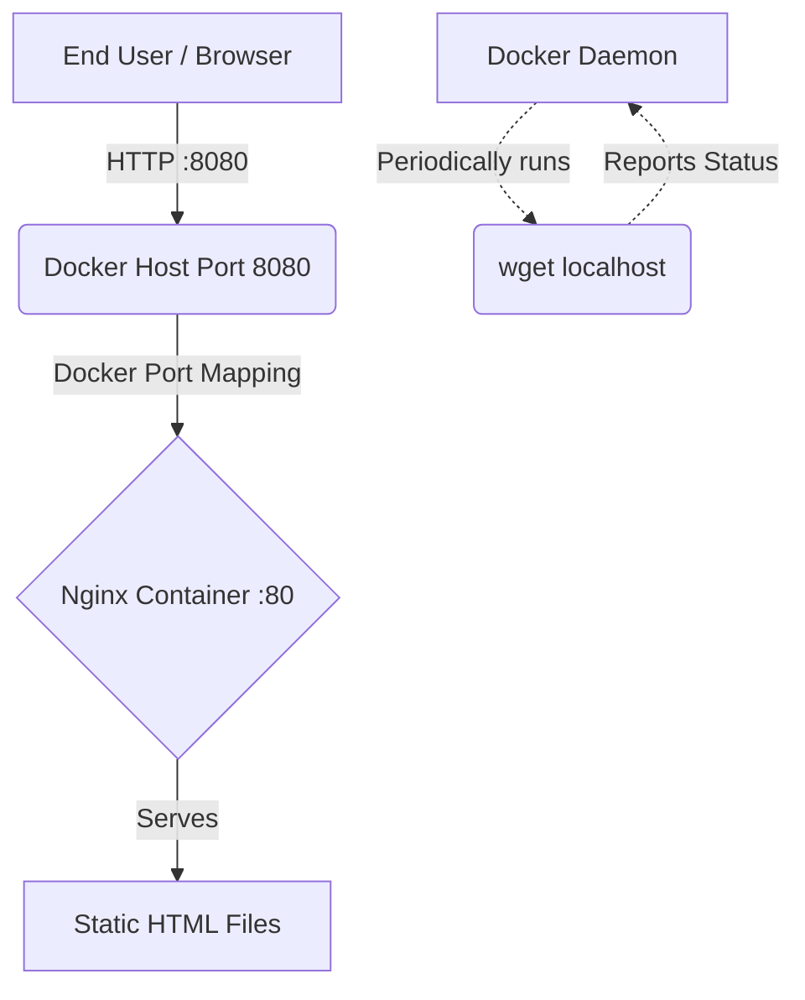

# Project Architecture: Docker Web Server

## High-Level Architecture
This demonstrates a single-container architecture hosting a static website using Nginx.

## Component Details

### 1. Docker Host
**Role:** The machine (your laptop or a cloud VM) running the Docker Engine.
- The `docker-compose.yml` maps port `8080` on the host to port `80` inside the container. This isolates the container's internal networking from the host, only exposing what is explicitly mapped.

### 2. The Container Image (Nginx Alpine)
**Role:** The lightweight operating system and web server.
- **Base Image:** We use `nginx:alpine`. Alpine Linux is specifically designed to be tiny (~5MB), making the resulting Docker image much smaller, faster to pull, and more secure (smaller attack surface).
- **Immutability:** The HTML files are copied *into* the container during the `docker build` phase. This means the container image is self-contained and immutable. You can run it exactly the same way on any machine that has Docker installed.

### 3. Nginx Web Server
**Role:** Handling HTTP requests.
- Runs inside the container on port 80.
- Nginx is highly optimized for serving static content quickly and efficiently.

### 4. Health Check Mechanism
**Role:** Self-monitoring.
- Defined in the Dockerfile. The Docker daemon itself executes `wget -qO- http://localhost/` inside the container every 30 seconds.
- If Nginx crashes or gets stuck, the `wget` command will fail, and the Docker daemon will mark the container state as unhealthy. This is the foundation of self-healing architectures in modern container orchestration.
